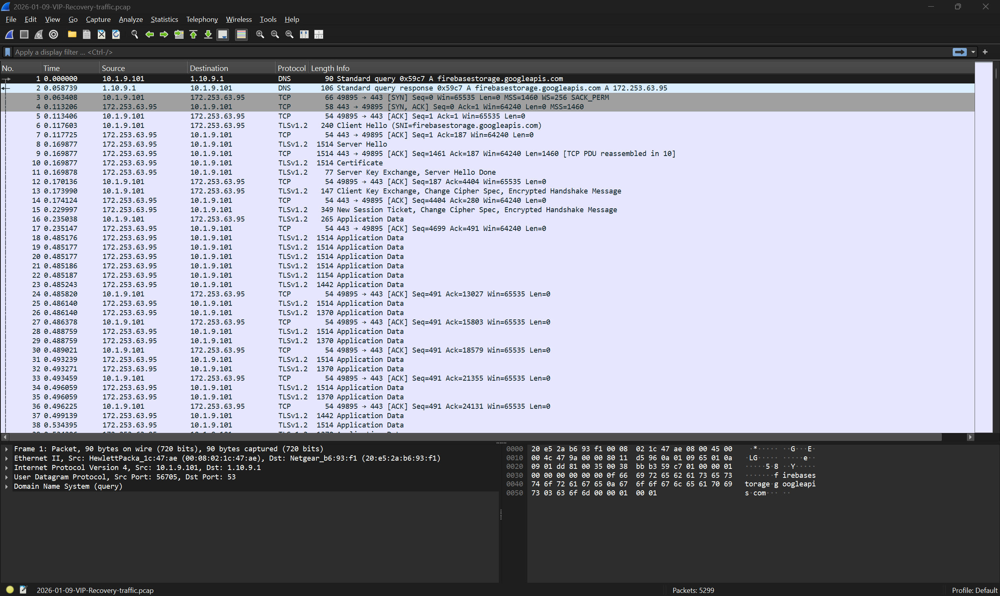
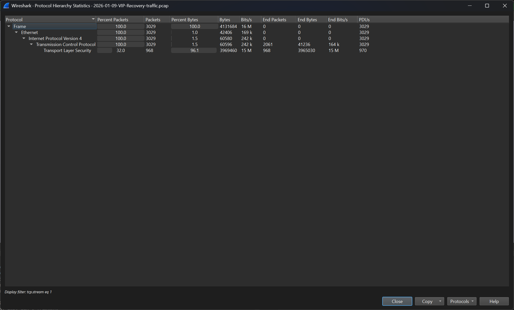
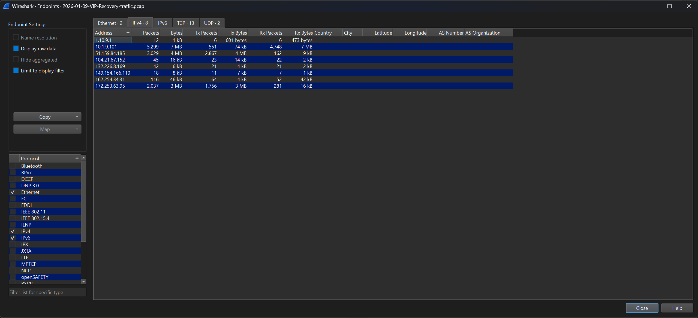
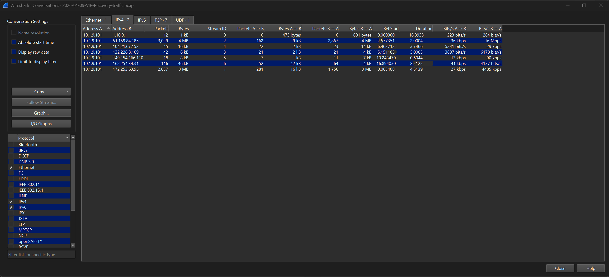
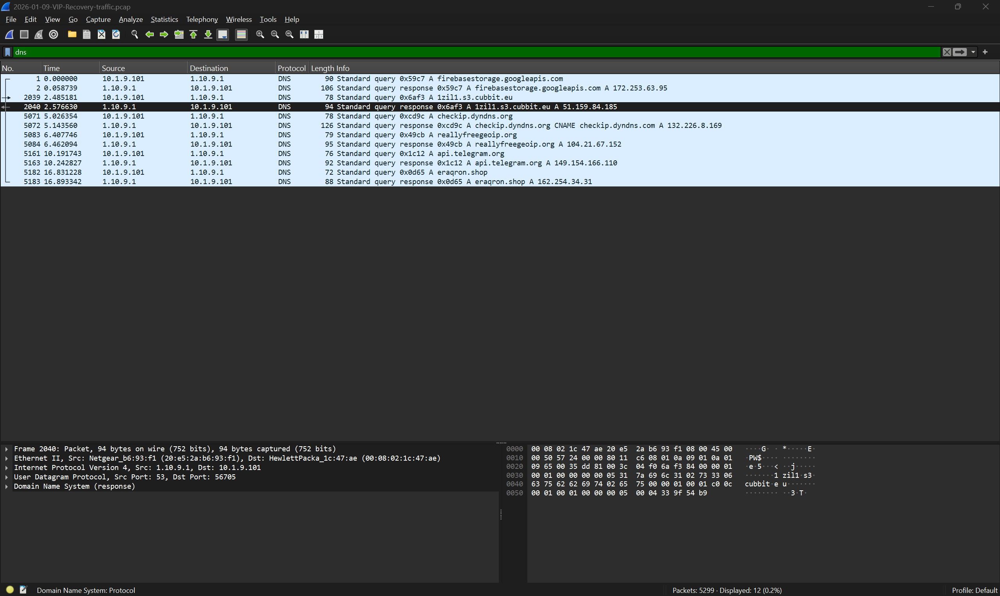
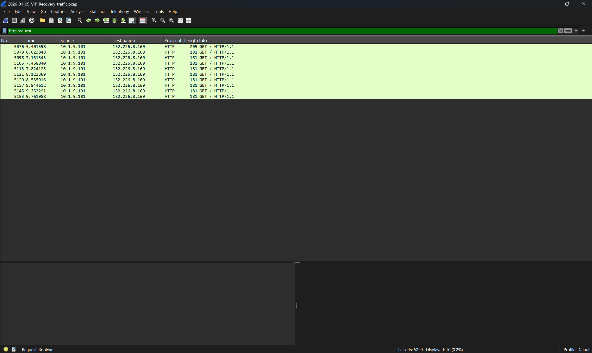
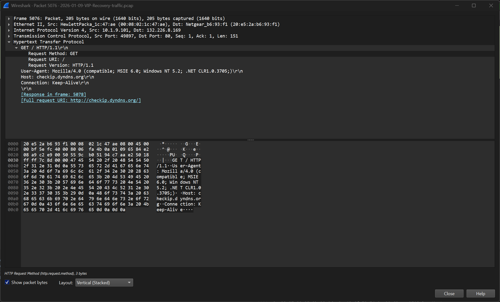
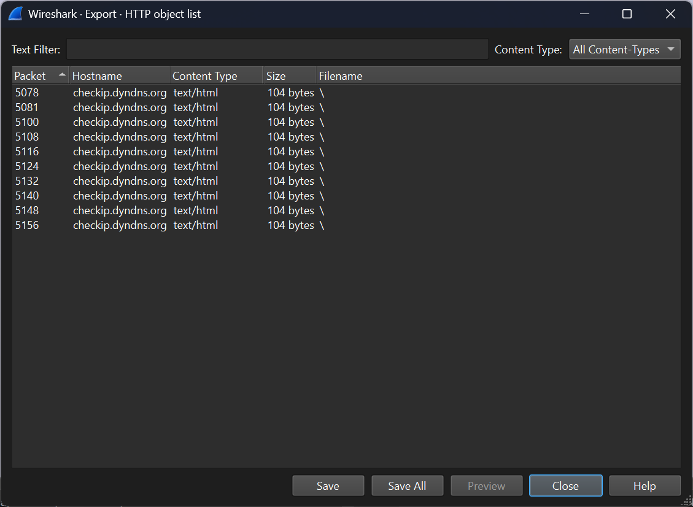
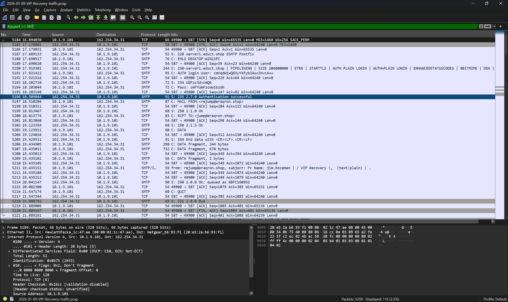

# VIP Recovery Network Forensics Investigation

## Executive Summary

This project documents a network forensic investigation of the VIP Recovery malware-related packet capture (PCAP) provided by Malware-Traffic-Analysis.net. Using Wireshark, the PCAP was analyzed to identify the compromised workstation, analyze DNS, TCP connections, TLS handshakes, HTTP communications, and SMTP communications observed in the capture, extract indicators of compromise (IOCs), reconstruct the observed communication sequence, and map network behaviors to the MITRE ATT&CK framework.

## Background

The Malware-Traffic-Analysis.net case scenario describes an incident in which a phishing email containing a malicious ZIP archive was delivered to a victim. According to the scenario, extracting the archive executed a Visual Basic Script (VBS), resulting in malicious network activity that was recorded in the PCAP. The PCAP served as the primary source of forensic evidence analyzed during this investigation.

Although the case scenario provided background information about the suspected infection chain, the findings presented in this report are based solely on forensic analysis of the PCAP using Wireshark. All documented indicators of compromise (IOCs), observed network communications, and investigation conclusions were derived from evidence contained within the capture.

## Tools and Resources

- Wireshark
- MITRE ATT&CK Framework
- Malware-Traffic-Analysis.net (VIP recovery PCAP)

# Investigation Findings

## Victim Workstation

- **IP Address:** `10.1.9.101`
- Identified as the compromised workstation based on IPv4 Endpoint Statistics and IPv4 Conversation analysis.
- Generated the highest volume of observed network activity within the packet capture.
- Initiated DNS, HTTP, TLS, and SMTP communications with multiple external systems throughout the investigation.
- Served as the primary focus of the network forensic analysis because it was responsible for the majority of the observed communications.

## Observed Network Communication Sequence

After DNS resolution, the compromised workstation established multiple TCP connections with external systems. HTTPS communications were preceded by TLS handshakes that negotiated encrypted sessions before application data was exchanged. Later in the capture, a separate authenticated SMTP session was observed with the eraqron.shop mail server over TCP port 587.

## Indicators of Compromise (IOCs)

The following domains and IP addresses were observed during the investigation and are documented as indicators associated with the captured network activity. Their inclusion does not necessarily indicate that every domain or IP address is inherently malicious; some represent legitimate services contacted during the observed communications.

## Domains

- firebasestorage.googleapis.com
- 1zil1.s3.cubbit.eu
- checkip.dyndns.org
- reallyfreegeoip.org
- api.telegram.org
- eraqron.shop

## IP Addresses

- 172.253.63.95
- 51.159.84.185
- 132.226.8.169
- 104.216.7.152
- 149.154.166.110
- 162.254.34.31

## MITRE ATT&CK Mapping

The observed network behaviors were mapped to the MITRE ATT&CK framework to classify adversary techniques identified during the investigation.

| Technique ID | Technique | Evidence Observed |
|--------------|-----------|-------------------|
| T1071.004 | DNS | DNS queries were observed resolving external domains including `api.telegram.org`, `eraqron.shop`, `firebasestorage.googleapis.com`, and other domains before outbound communications were established. |
| T1071.001 | Application Layer Protocol | HTTP and SMTP application-layer protocols were observed communicating with external systems throughout the investigation. |
| T1041 | Exfiltration Over C2 Channel | Observed authenticated outbound SMTP communication consistent with behavior described by T1041. The PCAP alone does not confirm that sensitive data was exfiltrated or that the recipient was attacker-controlled. |

---
# Investigation Screenshots
---
## 1. Evidence Loaded

The packet capture was successfully loaded into Wireshark, confirming a total of 5,299 captured packets for analysis. Initial inspection identified DNS, TCP, and TLS traffic originating from the internal workstation (Ip address), providing the starting point for the investigation.
---
## 2. Protocol Hierarchy

The protocol hierarchy identified the primary protocols present in the capture, including DNS, HTTP, TCP, and TLS. This overview established the types of network communications that would be investigated throughout the incident.
---
## 3. Victim Host Identification

IPv4 endpoint statistics identified **10.1.9.101** as the primary workstation involved in the investigation. This host generated the largest amount of network traffic and became the primary focus of the analysis.
---
## 4. Network Conversations

Conversation statistics revealed the external systems communicating with the infected workstation. The largest volume of traffic occurred between the victim host and **51.159.84.185**, identifying it as a high-priority communication for further investigation.
---
## 5. DNS Analysis

DNS traffic identified several external domains including Telegram infrastructure, and additional external domains used during the infection.
---
## 6. HTTP Requests

HTTP GET requests were examined to determine the resources requested by the compromised host. 
---
## 7. HTTP Header Analysis

Inspection of the HTTP request headers identified the destination host, request method, user agent, and requested URI. These details provided additional context regarding the workstation's outbound communications.
---
## 8. HTTP Objects

Reviewing transferred objects helped identify files and additional transferred web objects observed during the investigation.
---
## 9. SMTP Analysis

Analysis of traffic over TCP port 587 identified unencrypted SMTP communications between the compromised workstation and 162.254.34.31. The SMTP session involved the domain `eraqron.shop` and included the following email addresses:

- **Sender:** `rejump@eraqron.shop`
- **Recipient:** `jump@eraqron.shop`

Because the SMTP session was unencrypted, the sender and recipient email addresses were visible within the packet capture.

---
## Lessons Learned

- Correlating DNS, TCP, TLS, HTTP, and SMTP communications provided significantly more context than analyzing any single protocol in isolation.
- Encrypted communications remained valuable for investigation because DNS activity, TLS handshake metadata, connection endpoints, and communication patterns continued to reveal network activity and communication behavior.
- Documenting indicators of compromise (IOCs) and mapping observed activity to the MITRE ATT&CK framework improved the organization, communication, and operational value of the investigation findings.
- A structured, evidence-based methodology enabled the observed network communication sequence to be reconstructed and supported clear, repeatable forensic findings.

## Conclusion

Analysis of the packet capture identified 10.1.9.101 as the compromised workstation responsible for the majority of the observed network communications. Examination of DNS, HTTP, TLS, SMTP, and TCP traffic reconstructed the observed network communication sequence, identified the external systems contacted by the compromised workstation, and documented outbound SMTP communications involving the eraqron.shop mail server. The investigation documented multiple indicators of compromise (IOCs), including observed domains and IP addresses associated with the malware's activity, and mapped the observed network behaviors to the MITRE ATT&CK framework using T1071.004 (DNS), T1071.001 (Application Layer Protocol), and T1041 (Exfiltration Over C2 Channel). This investigation demonstrates how systematic packet analysis can identify compromised systems, reconstruct observed network communications, and produce evidence-based findings.
